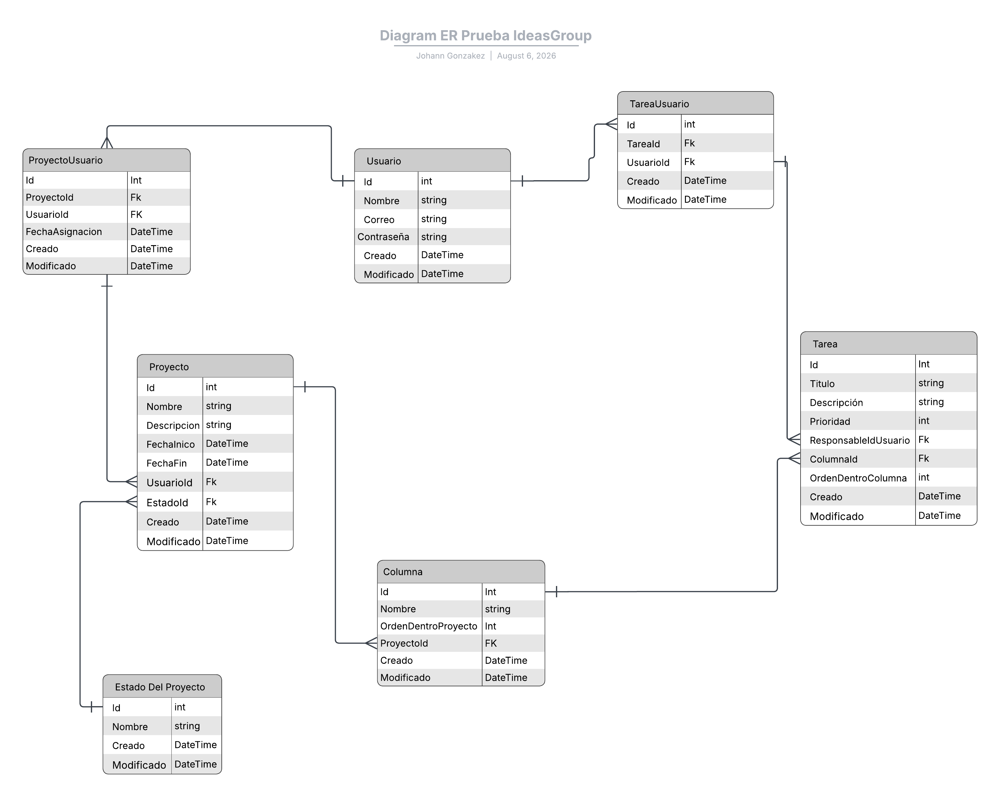

# Prueba Técnica - Ideas Group

Sistema de Gestión de Proyectos tipo Kanban con tablero interactivo en tiempo real y generación de reportes en PDF y Excel, desarrollado con **.NET 8 Web API** en el backend y **Angular 17** en el frontend.

---

## 1. Tecnologías y Librerías Clave

### Backend
* **Framework:** .NET 8 Web API (Arquitectura Limpia / Capas)
* **Persistencia:** Entity Framework Core 8 + PostgreSQL
* **Autenticación:** JWT (JSON Web Tokens) con BCrypt.Net-Next para hashing de contraseñas
* **Real-time:** SignalR
* **Generación de Reportes:** QuestPDF (PDF) y ClosedXML (Excel)
* **Testing:** xUnit, FluentAssertions (v6.12.0), Moq, EF Core InMemory

### Frontend
* **Framework:** Angular 17 (Standalone Components)
* **Estilos:** TailwindCSS / Angular Material
* **Comunicación:** HttpClient + WebSockets (SignalR Client)

---

## 2. ¿Por qué Utilicé estas librerías específicas?

### 1. QuestPDF (Generación de PDF)
* **Diseño Fluido y Declarativo:** A diferencia de librerías tradicionales basadas en posicionamiento absoluto (coordenadas X, Y), QuestPDF utiliza un enfoque fluido similar a HTML/CSS (Filas, Columnas, Tablas). Esto facilita la creación de reportes limpios y adaptables.
* **Rendimiento:** Genera documentos PDF directamente en memoria como arreglos de bytes (`byte[]`), reduciendo la sobrecarga de I/O al evitar crear archivos temporales en disco.
* **Tipado Fuerte:** Permite definir estilos, paginación y encabezados de forma fuertemente tipada en C#, minimizando errores en tiempo de ejecución.

### 2. ClosedXML (Generación de Libros de Excel)
* **Orientado a Objetos (OpenXML Wrapper):** La API nativa de Microsoft OpenXML es orientada a bajo nivel y muy verbosa. ClosedXML envuelve esa complejidad brindando métodos intuitivos para manipular filas, celdas, estilos, colores y fórmulas.
* **Compatibilidad Estándar:** Produce archivos `.xlsx` nativos completamente compatibles con Microsoft Excel, Google Sheets y LibreOffice Calc.
* **Eficiencia de Exportación:** Permite convertir colecciones de datos del modelo de dominio a tablas estructuradas de Excel en pocas líneas de código.

### 3. ASP.NET Core SignalR (Comunicación en Tiempo Real)
* **Experiencia Kanban Interactiva:** En un tablero Kanban, cuando un usuario mueve una tarea de columna o crea una nueva, el resto de los usuarios conectados deben ver el cambio reflejado instantáneamente sin necesidad de recargar la página (`F5`).
* **Abstracción de Protocolos:** SignalR gestiona automáticamente la conexión subyacente. Utiliza **WebSockets** por defecto cuando está disponible y cae elegantemente a *Server-Sent Events* o *Long Polling* si la red o el navegador lo requieren.
* **Hubs de Comunicación:** Simplifica la emisión de eventos desde el servidor hacia clientes específicos o grupos abonados al mismo proyecto.

---

## 3. Solución, Diseño y Funcionalidades

### 3.1 Modelo Entidad Relación. 

### 3.1.2 Estructura de la Solución

.
├── docker-compose.yaml
├── PruebaIdeasGroup/               # Backend en .NET 8
│   ├── Application/
│   │   ├── DependencyInjection.cs
│   │   ├── Dtos/
│   │   │   ├── AuthDto.cs
│   │   │   ├── ColumnaDto.cs
│   │   │   ├── EstadoProyectoDto.cs
│   │   │   ├── ProyectoDto.cs
│   │   │   ├── TareaDto.cs
│   │   │   └── UsuarioDto.cs
│   │   ├── Mapping/
│   │   │   ├── ColumnaProfile.cs
│   │   │   ├── EstadoProyectoProfile.cs
│   │   │   ├── ProyectoProfile.cs
│   │   │   ├── TareaProfile.cs
│   │   │   └── UsuarioProfile.cs
│   │   ├── Ports/
│   │   │   └── In/                 # Puertos de Entrada (Casos de Uso)
│   │   │       ├── IAuthService.cs
│   │   │       ├── IColumnaService.cs
│   │   │       ├── IEstadoProyectoService.cs
│   │   │       ├── IExcelReporteService.cs
│   │   │       ├── INotificacionService.cs
│   │   │       ├── IPasswordService.cs
│   │   │       ├── IPdfReporteService.cs
│   │   │       ├── IProyectoService.cs
│   │   │       ├── ITareaService.cs
│   │   │       └── IUsuarioService.cs
│   │   └── Services/               # Servicios que implementan los Puertos de Entrada
│   │       ├── AuthService.cs
│   │       ├── ColumnaService.cs
│   │       ├── EstadoProyectoService.cs
│   │       ├── ExcelReporteService.cs
│   │       ├── PasswordService.cs
│   │       ├── PdfReporteService.cs
│   │       ├── ProyectoService.cs
│   │       ├── SignalRNotificacionService.cs
│   │       ├── TareaService.cs
│   │       └── UsuarioService.cs
│   ├── Controllers/               # Adaptadores de Entrada (REST API)
│   │   ├── AuthController.cs
│   │   ├── ColumnaController.cs
│   │   ├── EstadoProyectoController.cs
│   │   ├── ExcelReporteController.cs
│   │   ├── PdfReporteController.cs
│   │   ├── ProyectoController.cs
│   │   ├── TareaController.cs
│   │   └── UsuarioController.cs
│   ├── Domain/                    # Núcleo del Dominio
│   │   ├── Entities/
│   │   │   ├── Columna.cs
│   │   │   ├── EstadoProyecto.cs
│   │   │   ├── Proyecto.cs
│   │   │   ├── ProyectoUsuario.cs
│   │   │   ├── Tarea.cs
│   │   │   ├── TareaUsuario.cs
│   │   │   └── Usuario.cs
│   │   └── Ports/
│   │       └── Out/               # Puertos de Salida (Persistencia/Persistencia Externa)
│   │           ├── IColumnaRepository.cs
│   │           ├── IEstadoProyectoRepository.cs
│   │           ├── IProyectoRepository.cs
│   │           ├── ITareaRepository.cs
│   │           └── IUsuarioRepository.cs
│   ├── Infrastructure/            # Adaptadores de Salida (Infraestructura)
│   │   ├── Adapters/
│   │   │   └── Persistence/       # Adaptadores de Repositorio (EF Core)
│   │   │       ├── ColumnaRepository.cs
│   │   │       ├── EstadoProyectoRepository.cs
│   │   │       ├── ProyectoRepository.cs
│   │   │       ├── TareaRepository.cs
│   │   │       └── UsuarioRepository.cs
│   │   ├── Data/
│   │   │   └── ApplicationDbContext.cs
│   │   ├── DependencyInjection.cs
│   │   └── Hubs/                  # Adaptador WebSocket (SignalR)
│   │       └── BoardHub.cs
│   ├── Migrations/
│   ├── Properties/
│   │   └── launchSettings.json
│   ├── appsettings.Development.json
│   ├── appsettings.json
│   ├── Dockerfile
│   ├── Program.cs
│   └── PruebaIdeasGroup.csproj
├── PruebaIdeasGroup.Tests/       # Proyecto de Pruebas Unitarias
│   └── PruebaIdeasGroup.Tests.csproj
└── frontend/                      # Aplicación Angular 17+ (Estructura Estándar)
    ├── src/
    │   ├── app/
    │   │   ├── core/              # Guardias, Interceptores, Servicios Globales
    │   │   ├── features/          # Módulos/Componentes de Funcionalidades
    │   │   ├── shared/            # Componentes, Pipes y Directivas Reutilizables
    │   │   ├── app.component.ts
    │   │   ├── app.config.ts
    │   │   └── app.routes.ts
    │   ├── assets/
    │   └── environments/
    ├── angular.json
    ├── package.json
    └── tsconfig.json

## 3.2 Instalación de Librerías
Backend (.NET 8)
# Persistencia y PostgreSQL
dotnet add package Npgsql.EntityFrameworkCore.PostgreSQL
dotnet add package Microsoft.EntityFrameworkCore.Design

# Seguridad y Autenticación
dotnet add package Microsoft.AspNetCore.Authentication.JwtBearer
dotnet add package BCrypt.Net-Next

# Mapeo y Variables de Entorno
dotnet add package AutoMapper
dotnet add package AutoMapper.Extensions.Microsoft.DependencyInjection
dotnet add package DotNetEnv

# Reportes y Documentos
dotnet add package ClosedXML          # Reportes en Excel
dotnet add package QuestPDF           # Generación de PDF

# Documentación OpenAPI
dotnet add package Swashbuckle.AspNetCore
Frontend (Angular 17)

npm install @microsoft/signalr
## 3.3 Arquitectura Hexagonal (Puertos y Adaptadores)
Plaintext
       [ Cliente / Angular ]
                 │
                 ▼
     ┌───────────────────────┐
     │  Controllers / Hubs   │ ───► (Adaptadores de Entrada)
     └───────────┬───────────┘
                 │
                 ▼
     ┌───────────────────────┐
     │      Ports/In/        │ ───► (Interfaces / Puertos de Entrada)
     └───────────┬───────────┘
                 │
                 ▼
     ┌───────────────────────┐
     │      Services/        │ ───► (Lógica de Aplicación)
     └───────────┬───────────┘
                 │
                 ▼
     ┌───────────────────────┐
     │      Domain/          │ ───► (Entidades del Negocio)
     └───────────┬───────────┘
                 │
                 ▼
     ┌───────────────────────┐
     │      Ports/Out/       │ ───► (Interfaces / Puertos de Salida)
     └───────────┬───────────┘
                 │
                 ▼
     ┌───────────────────────┐
     │  Adapters/Persistence │ ───► (Adaptadores de Salida: Repositorios EF Core)
     └───────────────────────┘

# 4. Guía de Instalación y Ejecución
Para facilitar la evaluación de la prueba técnica, el proyecto se puede levantar de dos formas: mediante Docker Compose (método recomendado y automatizado) o de forma manual paso a paso.

Prerrequisitos
Si se opta por la instalación manual, asegúrate de contar con las siguientes herramientas instaladas:

.NET 8 SDK

Node.js (v18.0 o superior) y npm

Angular CLI (npm install -g @angular/cli)

PostgreSQL (v14 o superior)

Opción 1: Despliegue Rápido con Docker Compose (Recomendado)
Esta es la forma más rápida de ejecutar todo el ecosistema (PostgreSQL y Backend .NET 8) sin necesidad de configurar servicios locales.

Clonar el repositorio:

git clone <URL_DEL_REPOSITORIO>
cd <NOMBRE_DEL_DIRECTORIO>
Crear archivo de entorno local (Opcional):
Puedes crear el archivo .env en la raíz basándote en la sección de configuración de variables de entorno.

Construir y levantar los servicios:

docker-compose up -d --build
Verificar el acceso:

Backend API (Swagger): http://localhost:5000/swagger

Base de Datos (PostgreSQL): Puerto 5431 (o según tu .env)

Detener el entorno:

docker-compose down
Opción 2: Instalación y Ejecución Manual
1. Configuración de la Base de Datos (PostgreSQL)
Asegúrate de que el servicio de PostgreSQL se esté ejecutando localmente.

Crea una base de datos vacía llamada pruebaideasgroup.

Configura la cadena de conexión en el archivo PruebaIdeasGroup/appsettings.Development.json o mediante un archivo .env:

JSON
"ConnectionStrings": {
  "Default": "Host=localhost;Port=5432;Database=pruebaideasgroup;Username=postgres;Password=tu_contraseña"
}
2. Backend (.NET 8 Web API)
Navegar a la carpeta del proyecto backend:

cd PruebaIdeasGroup
Restaurar paquetes y dependencias:

dotnet restore
Aplicar las migraciones para crear la estructura de tablas:

dotnet ef database update
Iniciar la API:

dotnet run

La API iniciará y desplegará Swagger en http://localhost:5000/swagger.

3. Ejecución de Pruebas Unitarias (xUnit)
Para verificar las pruebas unitarias y de arquitectura:

cd ../PruebaIdeasGroup.Tests
dotnet test

4. Frontend (Angular 17)
Navegar a la carpeta del proyecto frontend:

cd ../frontend
Instalar dependencias:

Bash
npm install
Iniciar el servidor de desarrollo:

ng serve -o
La aplicación web se abrirá automáticamente en http://localhost:4200.

5. Configuración de Variables de Entorno (.env)
El proyecto utiliza archivos de variables de entorno para gestionar credenciales, puertos y claves JWT de forma segura sin exponerlas en el código fuente.

1. Variables Globales / Docker Compose (.env en la raíz)
Crea un archivo .env en la raíz del proyecto para sobreescribir la configuración por defecto de la base de datos y los puertos expuestos por Docker:

Fragmento de código
# Configuración de Base de Datos (PostgreSQL)
DB_USER=postgres
DB_PASSWORD=pruebaIdeasGroup1234
DB_NAME=pruebaideasgroup
DB_PORT=5431

# Configuración de Servidor API
API_PORT=5000

## Nota sobre el puerto de DB: Se configura el puerto host 5431 para evitar colisiones en caso de que tengas otra instancia de PostgreSQL ejecutándose localmente en el puerto por defecto 5432.

2. Variables de Seguridad Backend (PruebaIdeasGroup/.env)
Crea un archivo .env dentro del directorio del proyecto backend (PruebaIdeasGroup/) para gestionar la autenticación y tokens de la API:

Fragmento de código
# Clave y Emisor de Tokens JWT
JWT_KEY="ClaveSuperSecretaDePruebaIdeasGroup123456789!"
JWT_ISSUER=PharmacySaasApi
JWT_AUDIENCE=PharmacySaasClient
JWT_EXPIRE_MINUTES=480

## Nota de Seguridad: La clave JWT_KEY debe poseer una longitud mínima de 32 caracteres (256 bits) para ser compatible con el algoritmo de firma HMAC-SHA256 utilizado por .NET.